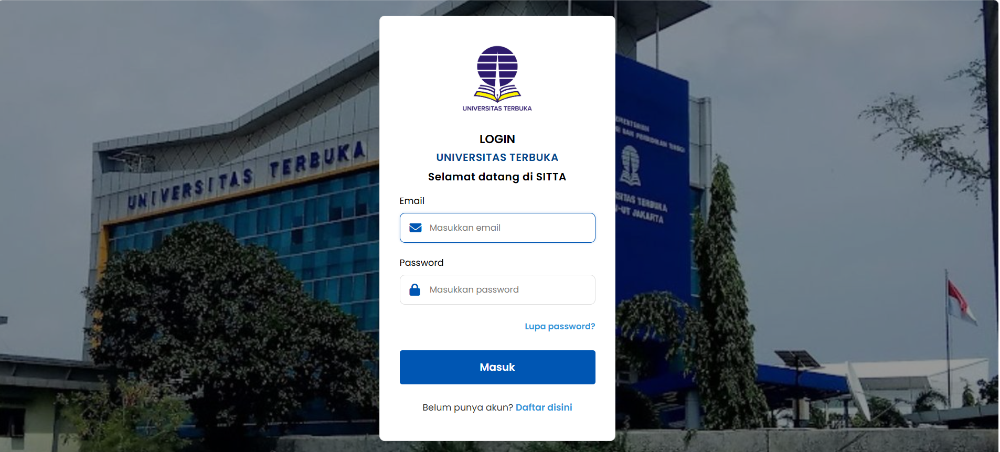

# SITTA Lite - Aplikasi Manajemen & Distribusi Bahan Ajar UT (Vue.js)

  

Selamat datang di repositori **SITTA Lite** (Sistem Informasi Tugas Tutorial dan Administras). Proyek ini dibangun untuk memenuhi **Tugas Praktik 2** pada mata kuliah Pemrograman Berbasis Framework, dengan mengimplementasikan konsep dasar Javascript Framework **Vue.js** (Production-ready Version/tanpa build tools) untuk mengelola manajemen stok dan pelacakan pengiriman bahan ajar secara interaktif.

---

## 🚀 Fitur Utama

Aplikasi ini terbagi menjadi dua halaman utama yang saling terintegrasi menggunakan data dummy (`dataBahanAjar.js`):

### 1. Halaman Stok Bahan Ajar (`stok.html`)
* **Visualisasi Data Stok:** Menampilkan daftar stok seluruh UT Daerah (UPBJJ) dalam bentuk tabel/list interaktif.
* **Sistem Filter & Sort Dependen:**
    * Filter dinamais berdasarkan UT-Daerah dan Kategori Mata Kuliah (berbasis *Dependent Options*).
    * Filter peringatan otomatis (*Re-order Alert*): Menyaring stok yang kritis ($qty < safety$) dan stok kosong ($qty = 0$).
    * Pengurutan (*Sorting*) berdasarkan Judul, Stok, dan Harga.
* **Manajemen Indikator Status:** * 🟢 **Aman** (Teks hijau/simbol jika $stok \ge safety$).
    * 🟠 **Menipis** (Teks oranye/warning jika $stok < safety$).
    * 🔴 **Kosong** (Teks merah/bahaya jika $stok = 0$).
* **Entri Data Baru:** Formulir input data bahan ajar baru yang dilengkapi dengan validasi *frontend* sederhana.

### 2. Tracking Delivery Order / DO (`tracking.html`)
* **Penerapan Vue.js pada Sistem Logistik:** Migrasi halaman pelacakan DO dari Tugas Praktik 1 ke dalam reaktivitas Vue.js.
* **Formulir Input DO Baru:**
    * *Auto-generated DO Number* dengan format dinamis: `DO2026-001` dan seterusnya.
    * Pemilihan Ekspedisi dan Paket Bahan Ajar secara reaktif menggunakan dropdown (`<select>`).
    * **Detail Paket Otomatis:** Menampilkan daftar isi paket di bawah form begitu nama paket dipilih.
    * Penghitungan otomatis untuk total harga berdasarkan *array of objects* paket.

---
